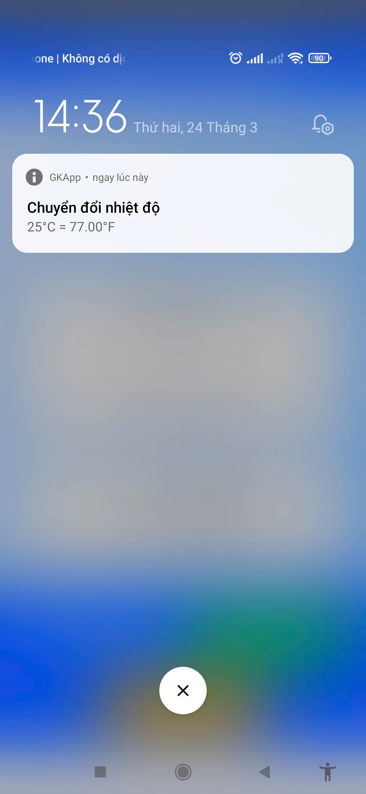
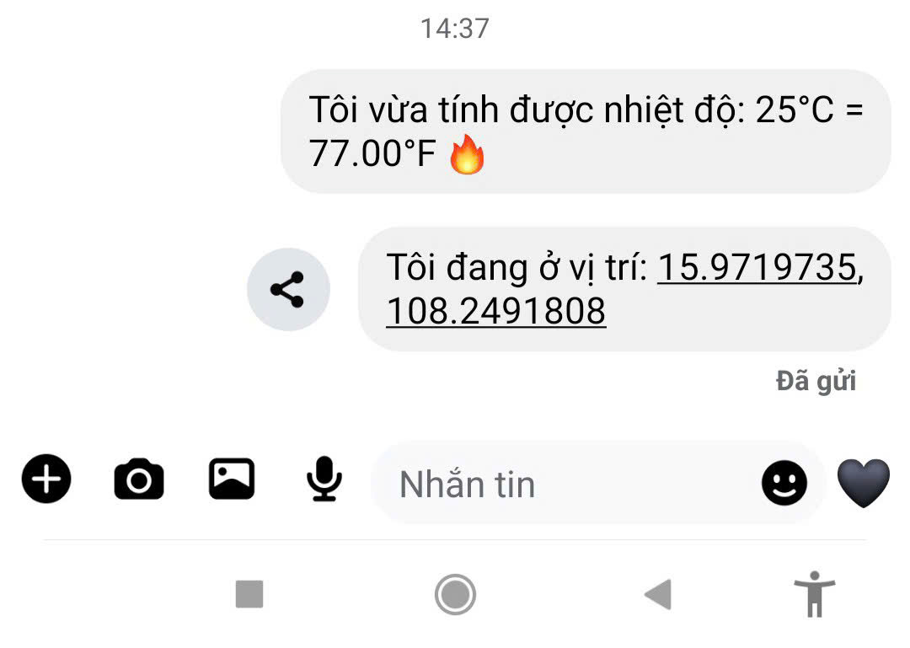

Ứng Dụng Chuyển Đổi Nhiệt Độ & Lấy Vị Trí
Giới Thiệu
Ứng dụng này giúp bạn chuyển đổi nhiệt độ từ °C sang °F và lấy vị trí hiện tại (tọa độ + địa chỉ). Hỗ trợ chạy trên trình duyệt và thiết bị Android với Capacitor.

Cách Cài Đặt & Chạy Ứng Dụng

1. Clone Repository
   bash
   Copy
   Edit
   git clone <repository-url>
   cd <project-folder>
2. Cài Đặt Dependencies
   bash
   Copy
   Edit
   npm install
3. Chạy Ứng Dụng trên Trình Duyệt
   bash
   Copy
   Edit
   npm run start
   Ứng dụng sẽ mở trong trình duyệt mà không cần server cục bộ.

4. Chạy Ứng Dụng trên Android
   bash
   Copy
   Edit
   npx cap sync android
   npx cap open android
   Sau đó, chạy ứng dụng trong Android Studio.

Công Nghệ Sử Dụng
Capacitor: Xử lý local notifications, chia sẻ dữ liệu, và lấy vị trí.

Tailwind CSS: Thiết kế giao diện đơn giản và đẹp mắt.

JavaScript (ES6+): Điều khiển logic ứng dụng.

[]

[]

[]

[]

[]
